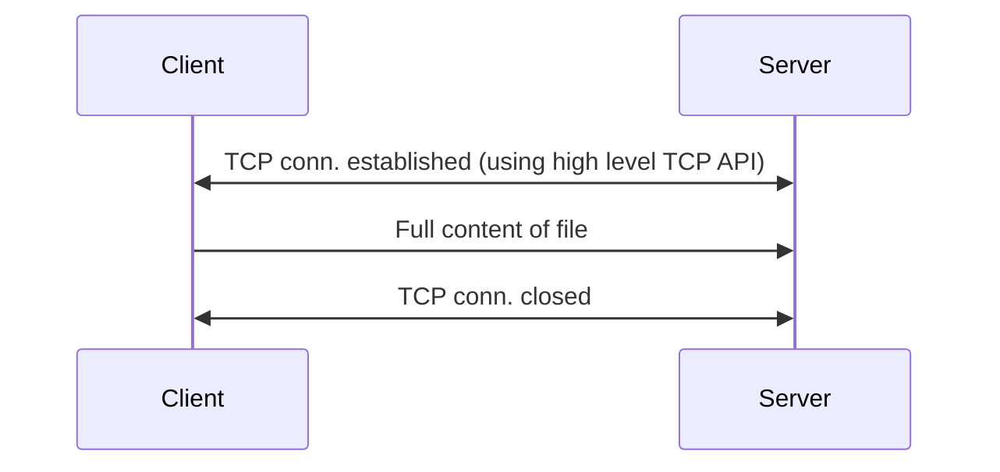

# Program 01 - HardCoded
This program serves as a "Hello, World" to network programming. It demonstrates how to transfer a file from a client to a server using high-level TCP APIs, keeping the implementation simple and minimal. For the sake of simplicity, file details are hardcoded into both the client and server, meaning the program is designed to transfer only that specific file.

## Overview of the Program
This program illustrates the use of TCP networking APIs (for e.g., TcpClient and TcpListener in C#, net.Socket and net.Server in Node.js) by implementing a file transfer mechanism.

## Current Limitations of the Program
* **Hardcoded payload**: The file to be sent is fixed in the code. Changing the file requires recompiling both the client and server.

* **No support for chunked transfer**: The entire file is sent in a single operation, which is inefficient for large files. A single dropped packet can require resending the whole file.

* **No pause/resume functionality**: The transfer cannot be paused or resumed once started. Also, the transfer cannot recover from any error.

* **Lack of security**: Data is sent as unencrypted bits over TCP, making it vulnerable to interception and inspection.