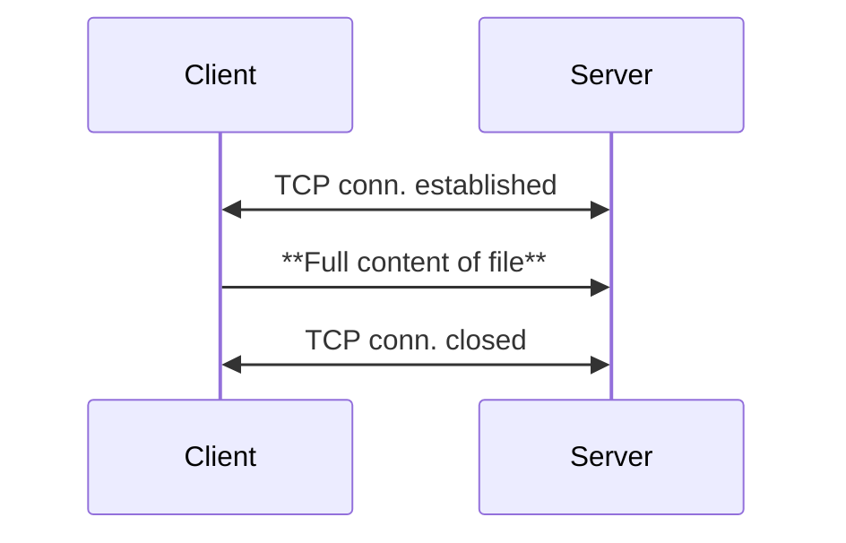

# Program 01 - HardCoded
### Overview
This program serves as a foundational "Hello, World" example for network programming. It illustrates the basic mechanism of transferring a file from a client to a server using high-level TCP APIs, with a focus on simplicity and minimalism. For demonstration purposes, the file path and related metadata are hardcoded on both the client and server sides, restricting the transfer to a specific, predefined file.

The server does not send any acknowledgements during the transfer. The entire file is transmitted in a single operation over the TCP connection, making retransmissions potentially expensive in case of packet loss. At this stage, there is no implementation of a Protocol Data Unit (PDU) or segmentation logic.

### Current Limitations of the Program
* **Hardcoded payload**: The file to be sent is fixed in the code. Changing the file requires recompiling both the client and server.

* **No support for chunked transfer**: The entire file is loaded into memory and sent in one go, which is inefficient for large files. It increases memory usage and any packet loss may require retransmitting the entire file.

* **No pause/resume functionality**: The transfer cannot be paused or resumed once started. Also, the transfer cannot recover from any error.

* **Lack of security**: Data is sent as unencrypted bits over TCP, making it vulnerable to interception and inspection.