# Program 01 - HardCoded
This program introduces the reader to network programming. We will be sending a file from a client to a server. We will keep things simple and bare minimum, for this we will use high level TCP APIs. Details of the file will be hard coded into client and server for simplicity. This means the programs can transfer that 1 file only.

```mermaid
sequenceDiagram
    participant Client as 📱 Client
    participant Server as 🖥️ Server

Client<<->>Server:TCP conn. established (using high level TCP API)
Client->>Server:Full content of file
Client<<->>Server:TCP conn. closed
```

This program has the following limitations.
* Static programs: Can't choose a different file to send. To do so, we need to recompile both client and server.
* No chunks: Entire file is sent in one go. Not practical for sending large files. Because a drop in a packet can cause the entire file to be retransmitted.
* No pause: No ability to pause and resume the transfer.
* Not secure: TCP does not encrypt traffic. Any one intercepting the traffic can see the contents of the file.