# Program 01 - HardCoded
This program introduces the reader to network programming. High level/course grained APIs are used to send a file from client to server. Details of the file is hard coded into client and server for simplicity which means the program can send that 1 file only.

```mermaid
sequenceDiagram
    participant Client as 📱 Client
    participant Server as 🖥️ Server

Client<<->>Server:TCP conn. established (using high level TCP API)
Client->>Server:Full content of file
```
