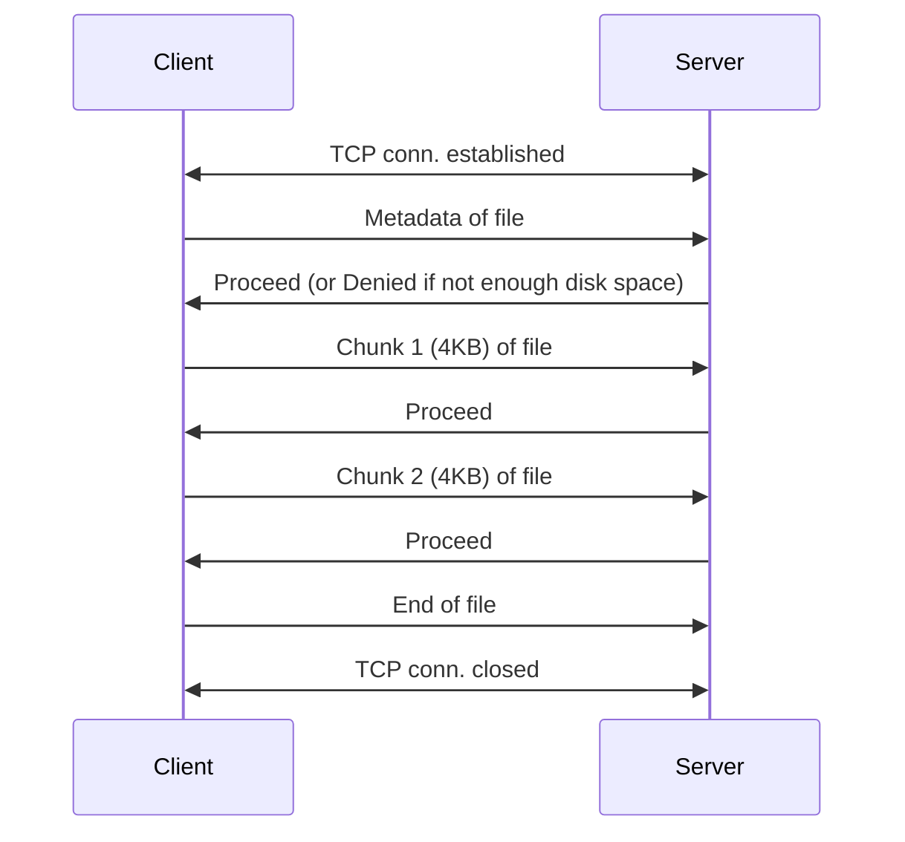
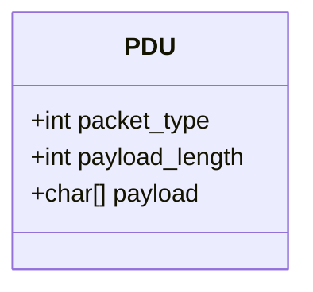

# Program 02 - ChunkedDynamic
### Overview
This program builds on the foundation established in Program 1 by addressing several key limitations. In the original version, file metadata was hardcoded, and the receiver was configured to read a fixed number of bytes (90,674) from the TCP channel. This approach restricted the system to transferring only a single, predefined file, limiting its flexibility and usefulness.

Additionally, the entire file was transmitted in a single write operation, making error recovery inefficient and costly in the event of data loss. The current version improves on these aspects by supporting the transfer of files of arbitrary size and introducing chunked transfer. Sending data in manageable chunks enhances reliability and makes error recovery more practical.

Further improvements include a disk space check on the server side. Before accepting the file, the server verifies whether sufficient storage is available. If there is enough space, the server responds with a one-byte message containing the value 1 ("Proceed"). If not, it responds with 0 ("Denied") and closes the connection.

To support dynamic file metadata, the client serializes the file name and size into a JSON string. Since the size of this JSON varies depending on the file, the client first sends a 4-byte integer indicating the length of the JSON string. The server reads this length to determine how many bytes to read next in order to receive the full metadata.   

#### Summary of Workflow:
* TCP connection is established.
* Client sends a 4-byte integer indicating the length of the metadata JSON.
* Client sends the metadata JSON containing the file name and size.
* Server checks available disk space.
 * If sufficient: sends a 1-byte value 1 ("Proceed").
 * If insufficient: sends a 1-byte value 0 ("Denied") and closes the connection.
* If the transfer is allowed, the client sends the file in 4KB chunks.
* After all chunks are sent, the client closes the connection.

### Current Limitations of the Program
* **Lack of security**: Data is sent as unencrypted bits over TCP, making it vulnerable to interception and inspection.