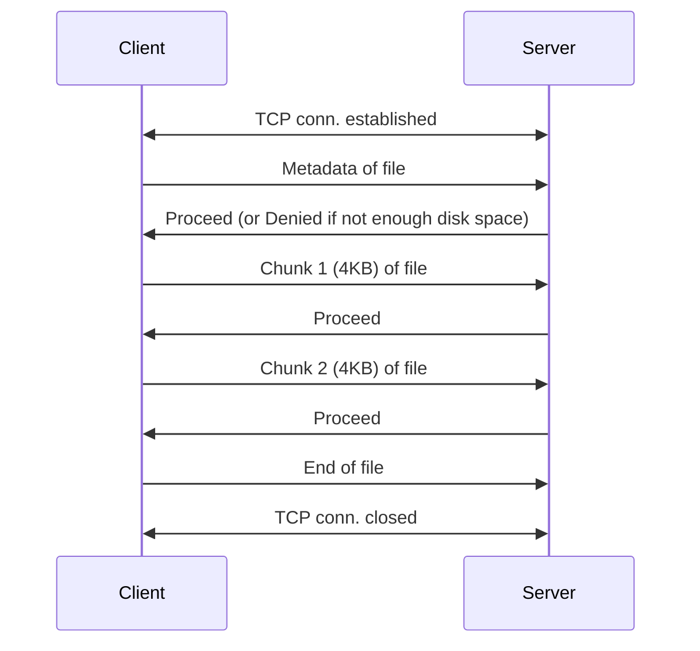
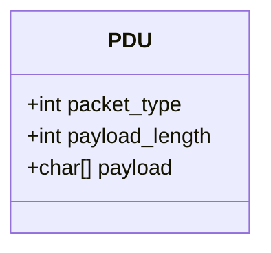

# Program 02 - ChunkedDynamic
### Overview
This program builds upon the foundation laid in Program 1, addressing several of its limitations. In the original implementation, file metadata was hardcoded, and the receiver was configured to read exactly 90,674 bytes from the channel. As a result, the system was limited to transferring only a specific file, which significantly reduced its practical utility.

Additionally, Program 1 transmitted the entire file in a single write operation, making error recovery both costly and inefficient. In this enhanced version, we introduce support for transferring files of arbitrary size. We also implement chunked transfer, which improves reliability and reduces the cost of error recovery in the event of packet loss.

In addition to the enhancements described earlier, the server program now includes a check to ensure sufficient disk space is available to store the incoming file. If adequate space is not available, the server will notify the client to abort the transfer by sending a "Denied" message.

Once the complete file has been successfully transmitted, the client will send a final "End of File" message to signal the end of the transfer. To support these control and data exchange mechanisms, the implementation introduces the concept of Protocol Data Units (PDUs), which encapsulate both metadata and payload in a structured format.

### Current Limitations of the Program
* **Lack of security**: Data is sent as unencrypted bits over TCP, making it vulnerable to interception and inspection.